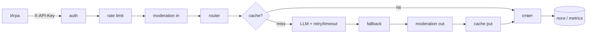

# Архитектура шлюза

```mermaid
flowchart LR
    G[Игра] -->|X-API-Key| A[auth] --> R[rate limit] --> M[moderation in] --> Ro[router]
    Ro --> C{cache?}
    C -- hit --> Out[ответ]
    C -- miss --> L[LLM + retry/timeout] --> F[fallback] --> Mo[moderation out] --> Cw[cache put] --> Out
    Out --> Log[(логи / metrics)]
```
